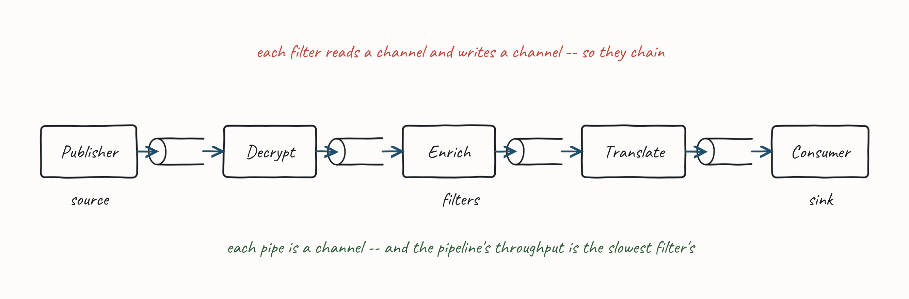
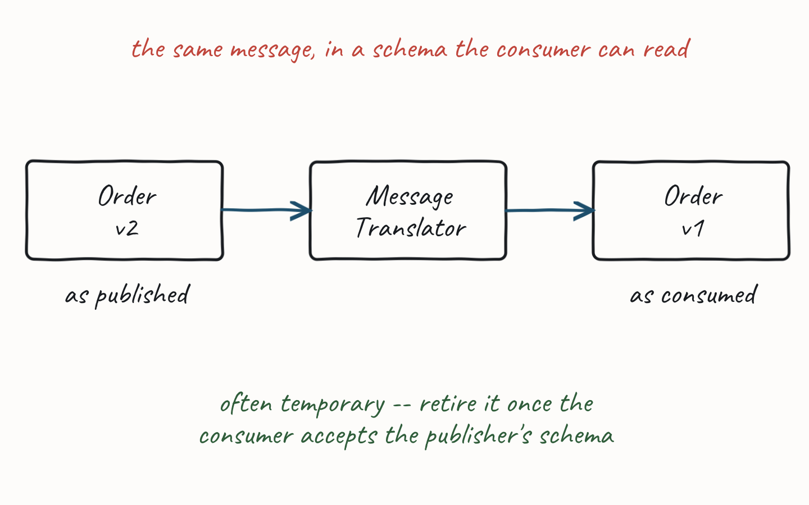
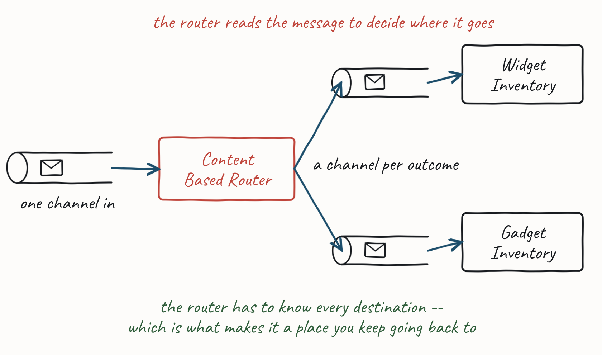
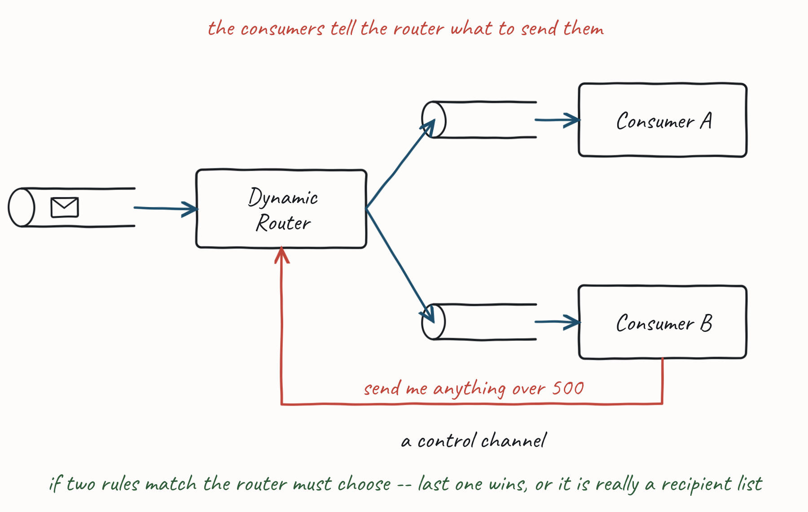
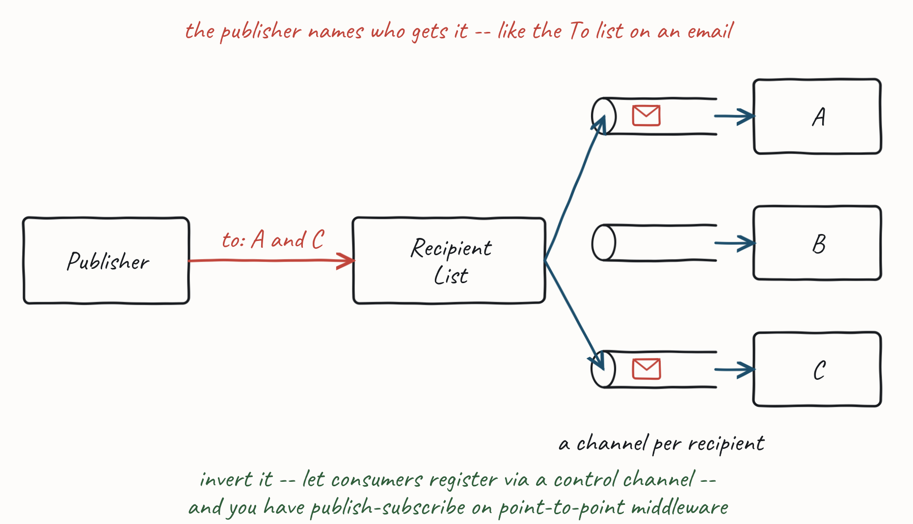
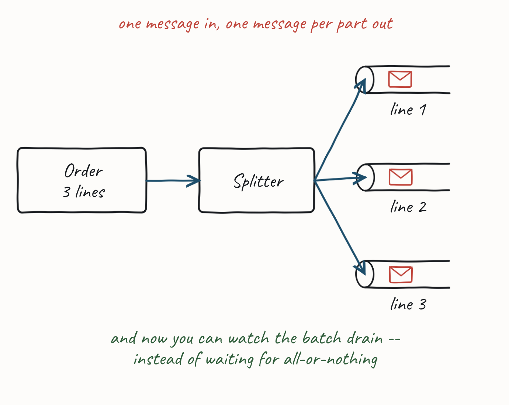
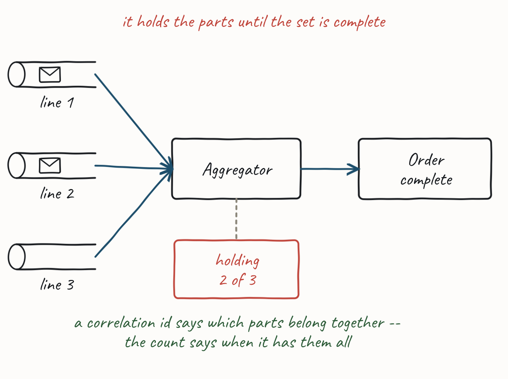
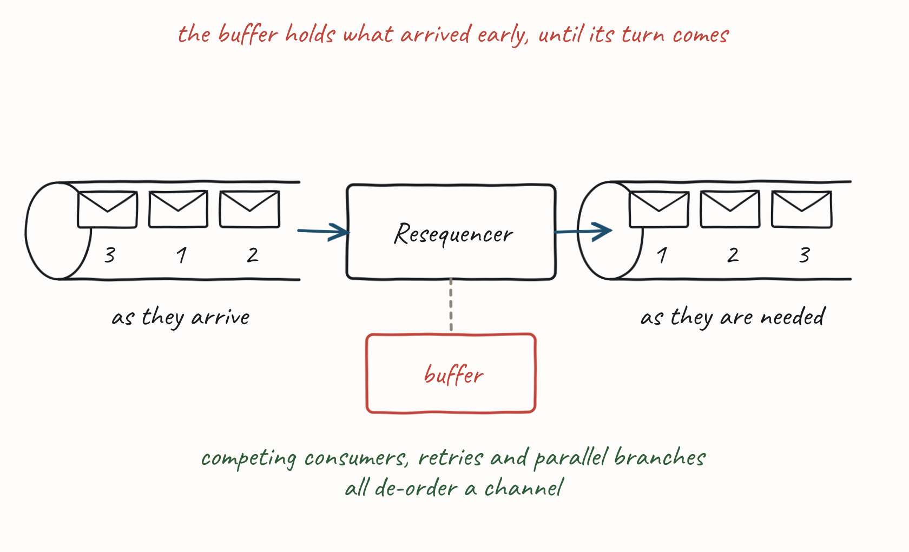

# Routing Patterns #

**A reference, not a talk.** Eight patterns for getting a message to the right place — and for taking
it apart and putting it back together on the way. None of them is taught from the front on either day;
they are here because they are the ones you will reach for at your desk, and because a page you can
look something up in beats a slide you saw once.

Everything here is from Gregor Hohpe and Bobby Woolf's *Enterprise Integration Patterns*. The
attribution page at the back says what is theirs and what is ours.

---

## The index ##

Every one of these lives inside a **pipeline** — a chain of steps between a publisher and the consumer
that finally acts. Pipes and Filters is the frame; the other seven are things you put in it.

| | pattern | the question it answers |
|---|---|---|
| **1** | [Pipes and Filters](#pipes-and-filters) | How do I do work on a message *between* publishing it and acting on it? |
| **2** | [Message Translator](#message-translator) | The consumer cannot read this schema. Now what? |
| **3** | [Content Based Router](#content-based-router) | The pipeline has to branch. Who decides which way? |
| **4** | [Dynamic Router](#dynamic-router) | …and how do I stop re-configuring the router every time the topology changes? |
| **5** | [Recipient List](#recipient-list) | What if the *publisher* wants to name who gets it? |
| **6** | [Splitter](#splitter) | This message has parts, and the parts go to different places. |
| **7** | [Aggregator](#aggregator) | Those parts need putting back together. When are they all in? |
| **8** | [Resequencer](#resequencer) | They came back out of order. |

### The three routers, side by side ###

**3, 4 and 5 all answer one question — *who decides where this message goes* — and they are only
distinguishable by the answer.** It is the thing to take away if you take away one thing:

| pattern | who holds the routing decision | you change the routing by |
|---|---|---|
| **Content Based Router** | **the router** — the rules are inside it | editing the router |
| **Dynamic Router** | **the consumers** — they register their own rules | starting a consumer |
| **Recipient List** | **the publisher** — it names the recipients on the way out | changing what the publisher sends |

Each figure reds the one that holds it, so you can see the difference on the page without reading a
word.

---

## 1. Pipes and Filters ##

When we publish a message, we may need to do work before the eventual subscriber of that message takes
action against our domain. We might need to encrypt or decrypt a message, we might need to enrich the
content of the message from other data stores, or we might need to transform the message from one
format to another.

Pipes and Filters is a pattern for dividing the transformation of data between origin and destination
into steps that can be combined together. A data **source** at the head of the pipe begins the flow,
and a data **sink** at the tail of the pipe receives the transformed output. **Filters** transform the
data as it flows through the pipe.

We can treat the publisher as the data source, the final consumer as the data sink, and consumers that
read, transform and publish that message before it reaches the sink as filters.

The structure is straightforward. Each filter receives a message on an inbound channel and publishes
it on an outbound channel. The pipe connects one filter to the next, sending output messages from one
filter to the next. Because each filter uses the same approach they can be composed into a chain. This
allows simple, easily testable filters to be composed into arbitrarily complex applications.

A processing pipeline lets us work in parallel, because a filter can take more work off the queue to
process when done, instead of blocking whilst the rest of the pipeline completes. This is known as a
processing pipeline because messages flow through the filters like liquid through a pipe.

**A processing pipeline's throughput is limited by the slowest point in the chain.** We could use
multi-threading within that filter, but the alternative is to use **Competing Consumers** to
parallelise the work of a stage. This allows one of many consumers to complete the work of that stage,
and is simpler to program and debug than using multi-threading.

> **Day 1 §4.3** covers Competing Consumers, and it is the lever that matters here.

---

## 2. Message Translator ##

The publisher may not use a format for a message that is understood by all consumers. This may be a
version issue — a downstream consumer may not be ready to receive a message whose format has a
breaking change. It may be an issue with schemas that are not under the control of the engineering
team, such as an external system or legacy code.

A **Message Translator** is a filter step that converts a message from one schema to another, so that
the output can be received by consumers that accept the alternative format.

In many cases a translator is temporary: once the consumer can accept the schema of the publisher, the
translator can be retired.

> A Translator changes the *shape* of a message. Its sibling, the **Content Enricher**, adds a *field*
> the publisher did not send — that one stayed on Day 1, in §6.2 Reference Data, because it is a
> message-design decision as much as a routing one.

---

## 3. Content Based Router ##

We may need a pipeline to branch. The condition that determines which path to take may be based on the
content of the message.

A **Content Based Router** examines the message content and routes the message onto a different
channel based on data contained in the message. The routing can be based on a number of criteria, such
as the existence of fields, specific field values, and so on.

The routing function should be easy to maintain, as the router can become a point of frequent
maintenance. Some middleware uses rules engines to support complex routing decisions. **Be wary of
moving too much decision-making into middleware**, as this can become difficult to maintain or test.

---

## 4. Dynamic Router ##

A Content Based Router can be difficult to maintain, because the router has to know about the possible
branches in the path — creating a need to re-configure that router if the topology of the system
changes.

A **Dynamic Router** solves this problem by using a rules engine to send messages to destinations
which can be configured at run time.

A **control channel** allows the configuration of the routing to be set by the consumers. As a
consumer starts up, it registers with the router to indicate the rules under which it should be sent
messages. The Dynamic Router runs the rules over a message on receipt and determines the destination.

Because consumers supply the rules under which the message should be routed to them, the Dynamic
Router must determine what happens **if two rules conflict**, indicating that a message should be
forwarded to more than one channel. Common strategies include *last one wins*. It is possible to route
to all valid routes, but this is often actually another pattern: the Recipient List.

---

## 5. Recipient List ##

In a Content Based Router, the properties of the message determine which branch a message takes. We
may want the publisher to be able to explicitly decide which branches to take, by means of a list of
those channels who should receive the message.

A metaphor here is the **To** list of an email: we indicate the recipients of the email and it is
routed to them.

We define a channel for each consumer. The **Recipient List** inspects an incoming message, determines
the list of desired consumers, and forwards the message to all channels associated with consumers in
that list.

It is possible to **invert** the Recipient List to give control to the consumers. In a *dynamic*
Recipient List, consumers send a list of the messages they wish to subscribe to, via a control
channel, to the Recipient List. This allows them to filter the messages that they wish to receive.

A dynamic Recipient List can be used to implement a **Publish-Subscribe Channel** where a messaging
system provides only Point-to-Point Channels. The Recipient List keeps a list of all the Point-to-Point
Channels subscribed to a topic; the publisher indicates the topic when sending the message, and the
Recipient List routes the message to the channels subscribed to that topic. This provides an
interception point, at the time of subscription, that can be used to provide control — such as
authorisation of subscriptions to a topic.

**Exchanges in RabbitMQ and SNS subscriptions in AWS are examples of dynamic Recipient Lists.**

---

## 6. Splitter ##

It may be that filters in the pipeline correspond with parts of a message, and it may be more efficient
to split a message into multiple messages derived from those parts, and send those new messages to
those filters.

A **Splitter** takes one input message and breaks it into multiple output messages.

For example, different line items in an order may need to be handled by different consumers, and a
splitter can route each line item in the order to the correct consumer.

It may also be useful where there is a **batch** of work in the original message. It can be difficult
to observe the progress of a batch — it is either all waiting to be done, or done. Splitting the batch
up allows us to observe the progress on the parts of the batch more easily, by the simple expedient of
monitoring the number of messages waiting to be processed in the channel.

---

## 7. Aggregator ##

A Splitter lets us break out a single message into parts — multiple messages that can be processed
individually. It may be necessary to recombine these parts for further processing.

For example, when we use a Splitter to break up a batch job, we want to know when the batch completes,
because all of the parts of the batch have completed. We also want to know if some parts of a batch
completed but others did not.

An **Aggregator** collects and stores individual messages until a complete set of related messages has
been received. Then the Aggregator publishes a single message distilled from the individual messages.

An Aggregator depends on being able to **correlate** messages, usually by adding a correlation id to
the message headers, to allow messages to be recombined. With a batch, it can also be useful for the
Aggregator to know **how many messages were in the batch**, so that it knows when it has seen them all.

> The correlation id is the one Day 2's Paper Flow exercise had you write by hand on every document
> that crossed a desk. This is what it was for.

---

## 8. Resequencer ##

If the pipeline has conditional or parallel filter steps, some messages may complete the pipeline
before others. If the messages were published in order, that order may now be lost.

Three things de-order a channel, and you will meet all three:

- In the presence of errors, a filter step might be **retried**, which may move the retried message out
  of order.
- If we have **Competing Consumers** reading from a channel, they will de-order the messages arriving
  on that channel.
- **Parallel or conditional branches** in the pipeline complete at different rates.

If we need to re-order messages we can use a **Resequencer**. A Resequencer uses an internal buffer to
store out-of-sequence messages until a complete sequence is obtained. The in-sequence messages are then
published to the output channel.

**How it works.** The Resequencer stores the sequence number of the next expected message. It first
looks in its own buffer, to see if it has already read that message from the channel. If not, it reads
another message from the channel. If that is the expected message it processes it; otherwise it puts it
into the buffer. The process then repeats. Eventually, a message waiting in the buffer will be the next
message, and will be freed.

---

## Where this came from ##

The eight patterns, their names and their structure are **Gregor Hohpe and Bobby Woolf, *Enterprise
Integration Patterns: Designing, Building, and Deploying Messaging Solutions* (Addison-Wesley, 2003)**
— and the pattern catalogue at **enterpriseintegrationpatterns.com**, which is free and is the version
to keep a tab open on.

The prose and the figures in this handout are ours. **The figures are redrawn**, not reproduced, and
they say what we want to say about each pattern rather than what the originals say; where you want the
canonical illustration, the site above has it. The one-idea-in-red convention is this course's, not
theirs.

**Related material in your pack**

| | |
|---|---|
| *Managing Asynchronous APIs* | describing and versioning the messages these patterns move |
| Day 1 §4.1–4.5 | *What Is a Message?* · *Sending and Receiving* · *The Message Pump* · *Guaranteed Delivery* · *Queues and Streams* |
| Day 1 §4.3 | Competing Consumers — the lever for a slow filter |
| Day 1 §6.2 | *Reference Data* — the Content Enricher, and the problem it answers |
| Day 2, Paper Flow | correlation ids, in-trays and out-trays, on paper |
